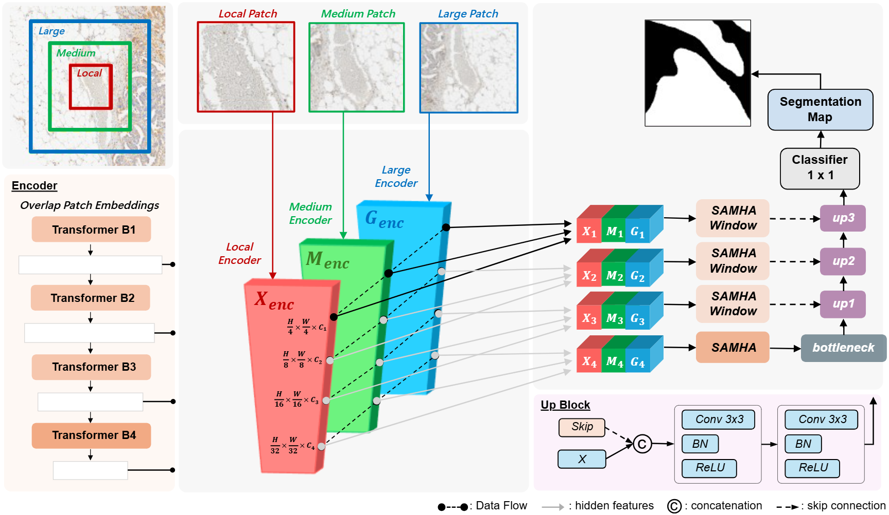
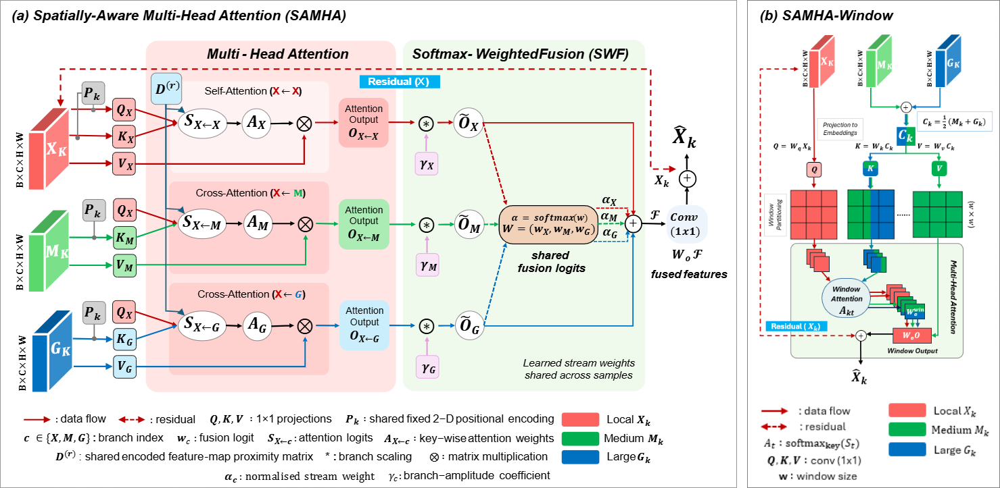

# SAMHA: Spatial-Aware Multi-Head Attention for Medical Image Segmentation

SAMHA is a PyTorch framework for binary medical image segmentation. It combines
multi-scale image context with spatial-aware attention so the model can use both
local tissue detail and wider anatomical context during prediction.

## Overview

The model uses a multi-field-of-view (multi-FOV) pipeline. Local, medium, and
large image patches are encoded in parallel, fused with SAMHA attention, and
decoded into a final segmentation mask.



SAMHA includes two attention variants:

- **SAMHA**: distance-aware cross-scale attention with learnable fusion.
- **SAMHA-Window**: window-based attention for efficient high-resolution stages.



In the module figure, **A** denotes the SAMHA block and **B** denotes the
SAMHA-Window block.

## Repository Structure

```text
SAMHA/
|-- train.py                     # Training entry point
|-- trainer.py                   # Training and evaluation loops
|-- args.py                      # Command-line arguments
|-- requirements.txt             # Python dependencies
|-- assets/architecture/         # Architecture figures
|-- dataset/dataloader.py        # Dataset loading
|-- model/                       # Model and attention modules
|-- notebook/run_samha.ipynb     # Single-image inference demo
`-- utils/                       # Metrics, losses, schedulers, inference helpers
```

Generated files such as checkpoints, TensorBoard logs, and notebook predictions
are written under `saved_models/`, `runs/`, or `notebook/` depending on the
workflow.

## Installation

Create and activate a Python environment, then install the project
dependencies:

```bash
pip install -r requirements.txt
```

The project uses PyTorch, torchvision, NumPy, Pillow, OpenCV, scikit-learn,
TensorBoard, Weights & Biases, and OpenSlide for whole-slide image support.

## Dataset Layout

The training script currently maps `--dataset 1` to `../dataset/dataset1/` and
`--dataset 2` to `../dataset/dataset2/`. Each dataset should follow this
structure:

```text
dataset1/
|-- train/
|   |-- images/
|   `-- gt/
`-- test/
    |-- images/
    `-- gt/
```

For `--dataset 1`, mask filenames should match image filenames. For
`--dataset 2`, masks are expected in `gt/` with the pattern
`<image_name>_mask.<ext>`.

## Quick Start

Run training and validation with all three context scales:

```bash
python train.py \
    --dataset 1 \
    --input_mode 3 \
    --task_name samha_run \
    --experiment exp01 \
    --train \
    --val
```

Run the notebook demo for single-image inference:

```bash
jupyter notebook notebook/run_samha.ipynb
```

Set the dataset path, checkpoint path, and image name inside the notebook before
running all cells.

## Training Options

Common arguments:

```bash
python train.py \
    --dataset 1 \
    --input_mode 3 \
    --num_epochs 50 \
    --batch_size 3 \
    --size_p 508 \
    --size_g 508 \
    --context_M 2 \
    --context_L 3 \
    --patch_overlap 0.20 \
    --task_name samha_run \
    --experiment exp01 \
    --train \
    --val
```

Important options:

| Argument | Description |
| --- | --- |
| `--dataset` | `1` for patch images, `2` for whole-slide image loading |
| `--input_mode` | `1` local only, `2` local + medium, `3` local + medium + large |
| `--use_window` | Enable SAMHA-Window attention |
| `--num_epochs` | Number of training epochs |
| `--batch_size` | Batch size for global images |
| `--sub_batch_size` | Batch size for local patch processing |
| `--size_p` | Local patch size |
| `--size_g` | Global image resize size |
| `--context_M` | Medium context multiplier |
| `--context_L` | Large context multiplier |
| `--patch_overlap` | Overlap ratio used during patch inference |
| `--gpu` | GPU device ID, for example `0` or `0,1` |

## Multi-Scale Modes

SAMHA can use one, two, or three input scales:

| Mode | Inputs | Use Case |
| --- | --- | --- |
| `1` | Local | Faster inference with local detail only |
| `2` | Local + medium | Adds regional context |
| `3` | Local + medium + large | Uses the full multi-scale design |

The local patch size is controlled by `--size_p`. The medium and large context
sizes are derived from `--context_M` and `--context_L`.

## How SAMHA Works

1. **Multi-scale input**: local, medium, and large patches are prepared from the
   same image region.
2. **Parallel encoding**: each scale is processed through its own encoder
   stream.
3. **Distance-aware attention**: SAMHA adds a spatial distance prior to the
   attention logits so nearby regions are favored while still allowing long-range
   interactions when content is similar.
4. **Learnable fusion**: features from each scale are combined with learned
   weights.
5. **Decoding**: fused features are upsampled into a segmentation mask.

## Outputs

Training checkpoints are saved to:

```text
saved_models/{dataset}/{experiment}/
```

TensorBoard logs are saved to:

```text
runs/{dataset}/{experiment}/
```

View logs with:

```bash
tensorboard --logdir=./runs
```

The notebook demo saves prediction arrays and mask visualizations in the
notebook output directory.

## Troubleshooting

| Problem | Suggested Fix |
| --- | --- |
| CUDA out of memory | Reduce `--batch_size`, `--sub_batch_size`, or `--input_mode` |
| Dataset path error | Check the expected `train/images`, `train/gt`, `test/images`, and `test/gt` folders |
| Mask not found | Confirm mask filenames match the expected naming rule |
| OpenSlide import error | Install OpenSlide system libraries and `openslide-python` |
| GPU not selected | Set `--gpu`, for example `--gpu 0` |
